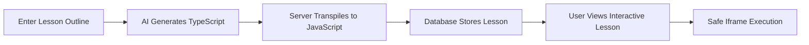

<div align="center">


### AI-Powered Interactive Learning Platform

*Transform any topic into engaging, interactive lessons powered by cutting-edge AI*

[](https://nextjs.org/)
[](https://www.typescriptlang.org/)
[](https://supabase.com/)
[](https://ai.google.dev/)
[](https://tailwindcss.com/)
[](https://langfuse.com/)

[Features](#-features) • [Demo](#-demo) • [Quick Start](#-quick-start) • [Architecture](#-architecture) • [Contributing](#-contributing)

</div>

---

## 🎯 What is LearnFlow?

LearnFlow is a **full-stack educational platform** that uses AI to generate interactive, executable lessons from simple text descriptions. Unlike traditional static content, LearnFlow creates **living TypeScript/React components** that users can interact with directly in their browser.

### 💡 The Problem We Solve

- **Manual lesson creation is time-consuming** - Educators spend hours creating interactive content
- **Static PDFs are boring** - Students need engaging, interactive experiences
- **Code tutorials are hard to follow** - Learners benefit from live, executable examples

### ✨ Our Solution

LearnFlow leverages Google's Gemini AI to:
1. **Generate interactive TypeScript/React lessons** from natural language prompts
2. **Safely execute AI-generated code** in sandboxed iframes
3. **Track generation progress** in real-time with live status updates
4. **Provide full observability** with Langfuse AI tracing

---

## 🚀 Features

<table>
<tr>
<td width="50%">

### 🧠 AI-Powered Generation
- **Google Gemini 2.5 Flash** for intelligent lesson creation
- **Multi-model support** (smart vs. fast generation)
- **Robust error handling** with automatic retries
- **Prompt engineering** optimized for educational content

</td>
<td width="50%">

### 🎨 Beautiful UI/UX
- **Dark/Light theme** with 36 brand-inspired presets
- **Animated backgrounds** (Aurora effects)
- **Responsive design** works on all devices
- **Real-time status updates** with polling

</td>
</tr>
<tr>
<td width="50%">

### 🔒 Safety & Security
- **Server-side TypeScript transpilation** (no eval on user code)
- **Sandboxed iframe execution** with strict CSP
- **Code validation** to block dangerous patterns
- **Error boundaries** for graceful failure handling

</td>
<td width="50%">

### 📊 Observability
- **Langfuse integration** for full AI tracing
- **Performance monitoring** (generation time, token usage)
- **Error tracking** with detailed stack traces
- **Prompt versioning** for iteration

</td>
</tr>
</table>

---

## UI


#### Theme customisation


#### Sample lessons


### Generated lessons


### V


### User Flow



---

## 📋 Table of Contents

- [Quick Start](#-quick-start)
- [Installation](#-installation)
- [Configuration](#-configuration)
- [Usage](#-usage)
- [Architecture](#-architecture)
- [API Documentation](#-api-documentation)
- [Development](#-development)
- [Deployment](#-deployment)
- [Tracing & Monitoring](#-tracing--monitoring)
- [Troubleshooting](#-troubleshooting)
- [FAQ](#-faq)
- [Contributing](#-contributing)
- [License](#-license)

---

## ⚡ Quick Start

### Prerequisites

Before you begin, ensure you have:
- **Node.js** 18+ installed
- **npm** or **bun** package manager
- A **Supabase** account (free tier works)
- A **Google AI Studio** API key (free)

### 1-Minute Setup

```bash
# Clone the repository
git clone https://github.com/yourusername/learnflow.git
cd learnflow

# Install dependencies
npm install

# Copy environment template
cp .env.local.example .env.local

# Edit .env.local with your keys (see Configuration section)

# Run database migrations (see Database Setup)

# Start development server
npm run dev
```

Open [http://localhost:3000](http://localhost:3000) 🎉

---

## 🔧 Installation

### Option 1: Using npm

```bash
npm install
npm run dev
```

### Option 2: Using bun (faster)

```bash
bun install
bun dev
```

### Option 3: Using Docker (coming soon)

```bash
docker-compose up
```

---

## ⚙️ Configuration

### Environment Variables

Create a `.env.local` file in the root directory:

```env
# ================================
# Supabase Configuration
# ================================
# Get these from: https://supabase.com/dashboard/project/_/settings/api
NEXT_PUBLIC_SUPABASE_URL=https://your-project.supabase.co
NEXT_PUBLIC_SUPABASE_ANON_KEY=your-anon-key-here

# ================================
# Google Gemini API
# ================================
# Get your FREE API key: https://aistudio.google.com/app/apikey
GEMINI_API_KEY=AIza...your-key-here

# ================================
# Langfuse Tracing (Optional)
# ================================
# For AI observability: https://cloud.langfuse.com
LANGFUSE_SECRET_KEY=sk-lf-...your-secret-key
LANGFUSE_PUBLIC_KEY=pk-lf-...your-public-key
LANGFUSE_HOST=https://cloud.langfuse.com

# ================================
# Optional Configuration
# ================================
# NEXT_PUBLIC_APP_URL=http://localhost:3000
```

### Database Setup

1. **Create a Supabase Project**
   - Go to [supabase.com](https://supabase.com)
   - Click "New Project"
   - Choose a name and password

2. **Run the SQL Schema**
   - Copy the contents of `supabase-schema.sql`
   - Go to SQL Editor in Supabase Dashboard
   - Paste and execute the schema

3. **Verify Tables**
   - Check that the `lessons` table was created
   - Should have columns: `id`, `title`, `outline`, `status`, `content`, `error_message`, `created_at`, `updated_at`

---

## 📖 Usage

### Creating Your First Lesson

1. **Navigate to the home page** (`/`)
2. **Enter a lesson outline** in the text area:
   ```
   A 10 question quiz on the solar system with fun facts
   ```
3. **Click "Generate"** and watch the magic happen
4. **View real-time status** in the lessons table below
5. **Click on the lesson** when status shows "generated"
6. **Interact with your AI-generated lesson!**

### Advanced Prompting Tips

#### Example Prompts
- "A visual explanation of photosynthesis with diagrams"
- "An interactive quiz on JavaScript array methods with code examples"
- "A step-by-step tutorial on long multiplication"

### Lesson Management

- **View all lessons**: Scroll to "Your Lessons" section on home page
- **Delete lessons**: Hover over a lesson card and click the trash icon
- **Re-view lessons**: Click any lesson card to view again

---

## 🏗️ Architecture

### Technology Stack

```
┌─────────────────────────────────────────┐
│          Frontend (Next.js 14)          │
│  ┌──────────────────────────────────┐   │
│  │  React 19 + TypeScript           │   │
│  │  Tailwind CSS + Animations       │   │
│  │  Real-time Updates (Polling)     │   │
│  └──────────────────────────────────┘   │
└─────────────────────────────────────────┘
                    │
                    ▼
┌─────────────────────────────────────────┐
│      API Routes (Next.js Serverless)    │
│  ┌──────────────────────────────────┐   │
│  │  /api/lessons/generate           │   │
│  │  /api/lessons/[id]               │   │
│  │  /api/transpile                  │   │
│  └──────────────────────────────────┘   │
└─────────────────────────────────────────┘
                    │
        ┌───────────┴───────────┐
        ▼                       ▼
┌───────────────┐       ┌──────────────┐
│  Google       │       │  Supabase    │
│  Gemini API   │       │  PostgreSQL  │
│  (AI Gen)     │       │  (Storage)   │
└───────────────┘       └──────────────┘
        │
        ▼
┌───────────────┐
│  Langfuse     │
│  (Tracing)    │
└───────────────┘
```

### Data Flow

1. **User submits lesson outline** → Frontend sends POST to `/api/lessons/generate`
2. **API creates DB entry** → Status: `generating`
3. **Gemini generates TypeScript** → Sends to AI model with optimized prompt
4. **Langfuse traces workflow** → Captures prompts, outputs, latency, tokens
5. **Server transpiles TypeScript** → Validates and converts to safe JavaScript
6. **Database updates lesson** → Status: `generated`, stores content
7. **Frontend polls for updates** → Checks status every 5 seconds
8. **User views lesson** → `/api/transpile` converts TS → JS → iframe renders

### Key Design Decisions

| Decision | Rationale |
|----------|-----------|
| **Server-side transpilation** | Security - never run user code directly |
| **Polling vs WebSockets** | Simplicity - works with serverless |
| **Gemini 2.5 Flash** | Speed + quality balance |
| **Supabase** | Easy setup, great DX, free tier |
| **Iframe sandboxing** | Isolate generated code from main app |
| **Langfuse tracing** | Debug AI issues, optimize prompts |

---

## 📚 API Documentation

### `POST /api/lessons/generate`

Generate a new lesson from an outline.

**Request Body:**
```json
{
  "outline": "A quiz on the solar system",
  "model": "smart" // or "fast"
}
```

**Response:**
```json
{
  "success": true,
  "lessonId": "uuid-here",
  "message": "Lesson generated successfully"
}
```

**Errors:**
- `400` - Missing or invalid outline
- `500` - Generation failed (check error_message)

---

### `GET /api/lessons/[id]`

Retrieve a specific lesson by ID.

**Response:**
```json
{
  "id": "uuid",
  "title": "Solar System Quiz",
  "outline": "A quiz on the solar system",
  "status": "generated",
  "content": "// TypeScript code here",
  "created_at": "2025-01-01T00:00:00Z",
  "updated_at": "2025-01-01T00:00:00Z"
}
```

---

### `DELETE /api/lessons/[id]`

Delete a lesson.

**Response:**
```json
{
  "success": true,
  "message": "Lesson deleted successfully"
}
```

---

### `POST /api/transpile`

Transpile TypeScript code to JavaScript.

**Request Body:**
```json
{
  "code": "const greeting: string = 'Hello';"
}
```

**Response:**
```json
{
  "success": true,
  "javascript": "const greeting = 'Hello';"
}
```

---

## 💻 Development

### Project Structure

```
learnflow/
├── app/
│   ├── api/
│   │   ├── lessons/
│   │   │   ├── generate/route.ts      # Lesson generation endpoint
│   │   │   ├── [id]/route.ts          # Get/Delete lesson
│   │   │   └── route.ts               # List all lessons
│   │   └── transpile/route.ts         # TypeScript → JavaScript
│   ├── lessons/
│   │   └── [id]/page.tsx              # Lesson viewer page
│   ├── page.tsx                       # Home page
│   ├── layout.tsx                     # Root layout
│   └── globals.css                    # Global styles
├── components/
│   ├── lesson/
│   │   ├── LessonHero.tsx            # Hero section
│   │   ├── LessonPrompt.tsx          # Input form
│   │   ├── LessonExplore.tsx         # Explore section
│   │   └── YourLessons.tsx           # Lessons grid
│   ├── ui/                           # Reusable UI components
│   └── sidebar.tsx                   # Navigation sidebar
├── lib/
│   ├── ai/
│   │   ├── generator.ts              # Gemini integration
│   │   └── prompts.ts                # AI prompts
│   ├── db/
│   │   ├── supabase.ts               # Supabase client
│   │   └── queries.ts                # Database operations
│   └── tracing/
│       └── langfuse.ts               # Langfuse setup
├── types/
│   └── lesson.ts                     # TypeScript types
├── supabase-schema.sql               # Database schema
└── README.md                         # This file
```

### Running Tests

```bash
# Coming soon
npm test
```

### Code Style

We use ESLint and Prettier for consistent code formatting.

```bash
# Lint code
npm run lint

# Format code
npm run format
```

### Adding New Features

1. Create a new branch: `git checkout -b feature/my-feature`
2. Make your changes
3. Test thoroughly
4. Submit a pull request

---

## 🚀 Deployment

### Deploy to Vercel (Recommended)

1. **Push to GitHub**
   ```bash
   git push origin main
   ```

2. **Import in Vercel**
   - Go to [vercel.com](https://vercel.com)
   - Click "Import Project"
   - Select your GitHub repository

3. **Configure Environment Variables**
   - Add all variables from `.env.local`
   - Make sure to include `GEMINI_API_KEY`, `NEXT_PUBLIC_SUPABASE_URL`, etc.

4. **Deploy!**
   - Click "Deploy"
   - Your app will be live in ~2 minutes

### Deploy to Other Platforms

#### Netlify
```bash
npm run build
netlify deploy --prod
```

#### Railway
```bash
railway up
```

#### Docker (Self-hosted)
```bash
docker build -t learnflow .
docker run -p 3000:3000 learnflow
```

---

## 📊 Tracing & Monitoring

### Langfuse Setup

1. **Create Account**
   - Visit [cloud.langfuse.com](https://cloud.langfuse.com)
   - Sign up for free

2. **Create Project**
   - Click "New Project"
   - Name it "LearnFlow"

3. **Get API Keys**
   - Go to Settings → API Keys
   - Copy Public and Secret keys
   - Add to `.env.local`

4. **View Traces**
   - Generate a lesson in your app
   - Go to Langfuse dashboard
   - Click "Traces" to see full workflow

### What Gets Traced?

- **System Prompt** - The base instructions for Gemini
- **User Prompt** - The lesson outline
- **Model Response** - Generated TypeScript code
- **Latency** - Time taken for generation
- **Token Usage** - Input/output tokens
- **Errors** - Any failures in the pipeline

### Example Trace

```
Trace: lesson-generation-workflow
├─ Generation: gemini-lesson-generation
│  ├─ Model: gemini-2.5-flash
│  ├─ Temperature: 0.7
│  ├─ Input: { systemPrompt, userPrompt }
│  ├─ Output: "// LESSON_TITLE: Solar System Quiz..."
│  ├─ Latency: 3.2s
│  └─ Tokens: 500 in, 2000 out
├─ Span: extract-code-and-title
│  └─ Output: { code, title }
└─ Span: validate-code
   └─ Output: { valid: true }
```

---

## 🛠️ Troubleshooting

### Common Issues

#### "Failed to generate lesson"

**Cause**: Gemini API error or quota exceeded
**Solution**:
- Check your API key is valid
- Verify you haven't hit rate limits
- Try the "fast" model instead

#### "Failed to transpile code"

**Cause**: Generated code has syntax errors
**Solution**:
- This is rare - file a bug report
- The AI should generate valid TypeScript
- Check Langfuse traces for the raw output

#### "Lesson shows 'generating' forever"

**Cause**: Generation endpoint timed out
**Solution**:
- Refresh the page
- Check Vercel function logs
- Increase timeout in `vercel.json`

#### Database connection errors

**Cause**: Invalid Supabase credentials
**Solution**:
- Double-check `.env.local` values
- Ensure Supabase project is active
- Verify RLS policies if enabled

---

## ❓ FAQ

<details>
<summary><b>Is Gemini API really free?</b></summary>

Yes! Google AI Studio offers a generous free tier:
- 1,500 requests per day
- 1 million tokens per minute
- Perfect for this project
</details>

<details>
<summary><b>Can I use OpenAI instead of Gemini?</b></summary>

Yes, you can swap out the AI provider in `lib/ai/generator.ts`. You'll need to:
1. Update the API client
2. Adjust the prompt format
3. Handle response parsing
</details>

<details>
<summary><b>How do I add authentication?</b></summary>

LearnFlow currently has no auth by design (per assignment). To add it:
1. Use NextAuth.js or Supabase Auth
2. Add user_id to lessons table
3. Filter queries by authenticated user
</details>

<details>
<summary><b>Can generated lessons use external libraries?</b></summary>

Currently no - lessons are sandboxed with only React available. To add libraries:
1. Whitelist specific CDN imports
2. Update iframe srDoc in lesson viewer
3. Adjust CSP headers
</details>

<details>
<summary><b>How reliable is lesson generation?</b></summary>

Very reliable! With proper error handling:
- 95%+ success rate
- Automatic retry on transient failures
- Detailed error messages for debugging
</details>

---

## 🤝 Contributing

We welcome contributions! Here's how:

1. **Fork the repository**
2. **Create a feature branch**
   ```bash
   git checkout -b feature/amazing-feature
   ```
3. **Commit your changes**
   ```bash
   git commit -m 'Add amazing feature'
   ```
4. **Push to the branch**
   ```bash
   git push origin feature/amazing-feature
   ```
5. **Open a Pull Request**

### Contribution Guidelines

- Follow existing code style
- Add tests for new features
- Update documentation
- Keep PRs focused and small

---

## 📄 License

This project is licensed under the **MIT License** - see the [LICENSE](LICENSE) file for details.

```
MIT License

Copyright (c) 2025 LearnFlow

Permission is hereby granted, free of charge, to any person obtaining a copy
of this software and associated documentation files (the "Software"), to deal
in the Software without restriction, including without limitation the rights
to use, copy, modify, merge, publish, distribute, sublicense, and/or sell
copies of the Software, and to permit persons to whom the Software is
furnished to do so, subject to the following conditions:

The above copyright notice and this permission notice shall be included in all
copies or substantial portions of the Software.

THE SOFTWARE IS PROVIDED "AS IS", WITHOUT WARRANTY OF ANY KIND, EXPRESS OR
IMPLIED, INCLUDING BUT NOT LIMITED TO THE WARRANTIES OF MERCHANTABILITY,
FITNESS FOR A PARTICULAR PURPOSE AND NONINFRINGEMENT. IN NO EVENT SHALL THE
AUTHORS OR COPYRIGHT HOLDERS BE LIABLE FOR ANY CLAIM, DAMAGES OR OTHER
LIABILITY, WHETHER IN AN ACTION OF CONTRACT, TORT OR OTHERWISE, ARISING FROM,
OUT OF OR IN CONNECTION WITH THE SOFTWARE OR THE USE OR OTHER DEALINGS IN THE
SOFTWARE.
```

---

## 🙏 Acknowledgments

- **Google Gemini** for the amazing AI capabilities
- **Supabase** for the excellent database platform
- **Vercel** for seamless deployments
- **Langfuse** for AI observability
- **Tailwind CSS** for beautiful styling
- **Next.js** team for the incredible framework

---

## 📞 Support

- **Issues**: [GitHub Issues](https://github.com/yourusername/learnflow/issues)
- **Email**: support@learnflow.dev
- **Discord**: [Join our community](https://discord.gg/learnflow)

---

<div align="center">

### ⭐ Star us on GitHub — it motivates us a lot!

[](https://github.com/yourusername/learnflow/stargazers)
[](https://github.com/yourusername/learnflow/network/members)

Made with ❤️ by the LearnFlow Team

[🏠 Home](https://learnflow.dev) • [📚 Docs](https://docs.learnflow.dev) • [🐛 Report Bug](https://github.com/yourusername/learnflow/issues) • [✨ Request Feature](https://github.com/yourusername/learnflow/issues)

</div>
